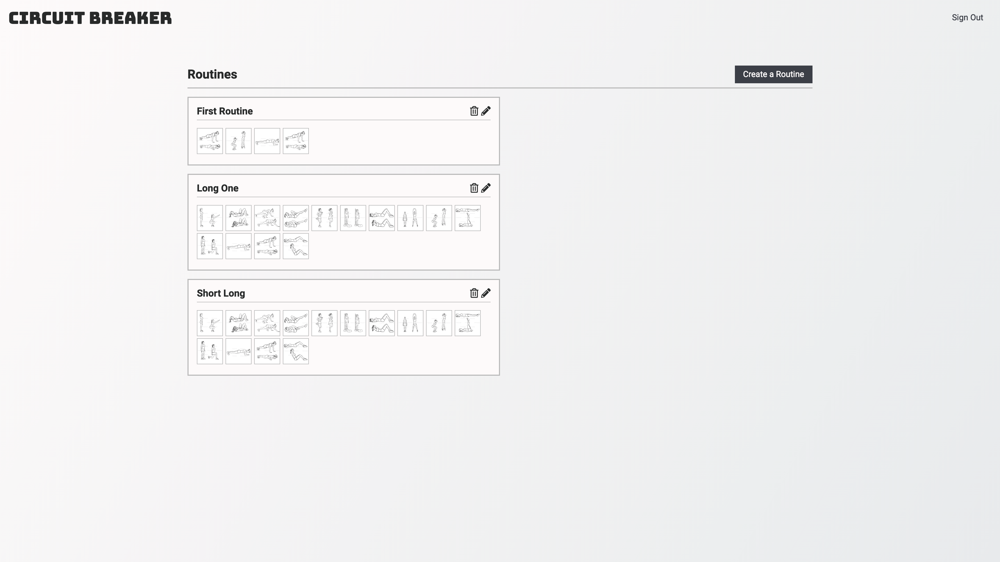
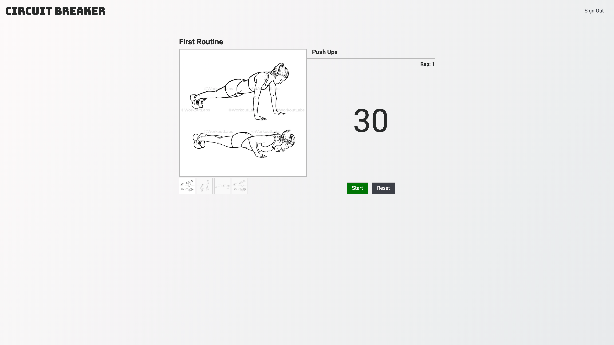

# Circuit Breaker

Circuit Breaker is a web application designed to walk you through your circuit training routine.

## Getting Started

Link to live site: https://ga-circuit-breaker.herokuapp.com/

### Features

#### Routines

<kbd>

</kbd>
 
 
When you create a routine, you first give it a name and then choose exercises that you want to do during your routine. When you select an exercise, a modal will pop up that allows you to select the duration of that exercise. After you've selected all of the exercises that you'd like to do in your routine, you can either save the routine if you're logged in or you can start the routine immediately without saving it.

#### Workout
<kbd>

</kbd>
 
 
When you click on a saved routine or hit "Start Routine" after creating one, you will be taken to the workout screen. When the workout screen first loads, a modal will appear and ask how many reps you would like to do. The number you enter will determine how many times you will repeat the routine. After each exercise is completed a bell will ding, signaling to you that it is time to switch to the next exercise. When all of the exercises are completed a modal will appear saying that the workout is over and will ask if you are done or would like to go again.

## Technologies Used

  1. Used [React](https://reactjs.org/) for the front end.
  2. Used [MongoDB](https://www.mongodb.com/) to store users and routines.
  3. Used [Node](https://nodejs.org/en/) and [Express](https://expressjs.com/) for the back end API.
  4. Used [Font Awesome](https://fontawesome.com/) for icons.
